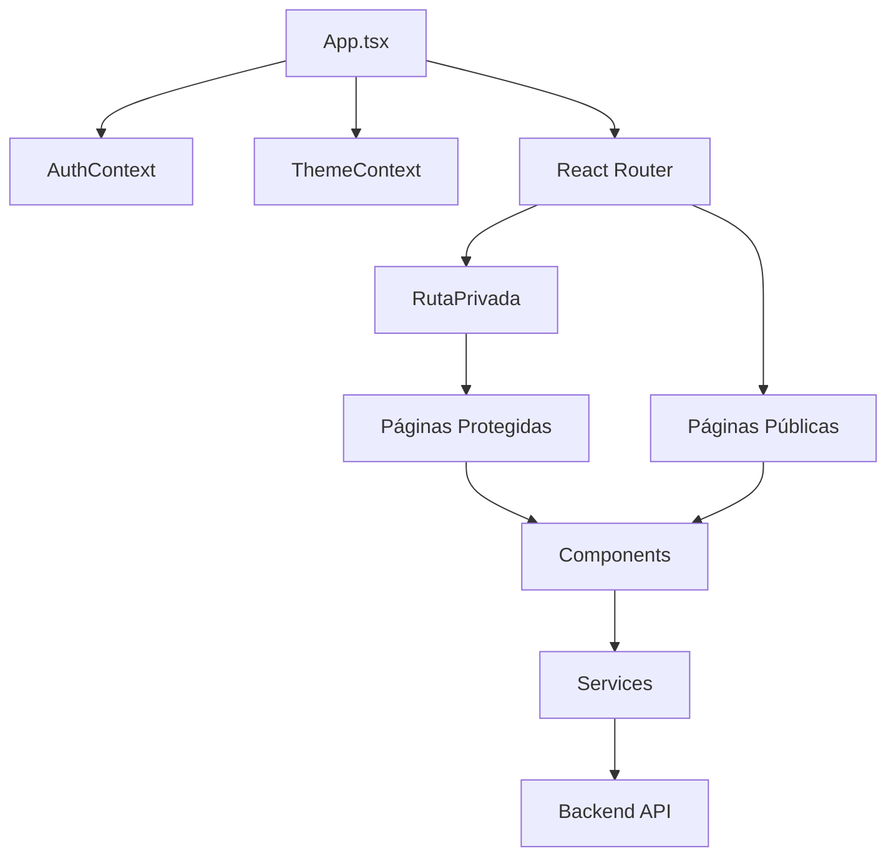

# 📱 Play4Padel Frontend - Aplicación Móvil y Web

<div align="center">

[](https://ionicframework.com)
[](https://typescriptlang.org)
[](https://vitejs.dev)
[](https://tailwindcss.com)
[](https://capacitorjs.com)
[](LICENSE)

**Aplicación móvil y web moderna para la gestión de clubes de pádel** 🏓

*Interfaz React con Ionic Framework para iOS, Android y Web - Experiencia nativa multiplataforma*

</div>

---

## 📖 Tabla de Contenidos

- [🌟 Características](#-características)
- [🏗️ Arquitectura Frontend](#️-arquitectura-frontend)
- [⚡ Inicio Rápido](#-inicio-rápido)
- [🛠️ Instalación](#️-instalación)
- [📱 Desarrollo Móvil](#-desarrollo-móvil)
- [🧪 Testing](#-testing)
- [🎨 Personalización](#-personalización)
- [🚀 Build y Despliegue](#-build-y-despliegue)
- [📚 Documentación](#-documentación)
- [🤝 Contribución](#-contribución)

---

## 🌟 Características

### 📱 **Experiencia Multiplataforma**
- ✅ **Web App Responsive**: Optimizada para todos los tamaños de pantalla
- ✅ **iOS & Android**: Apps nativas usando Capacitor
- ✅ **PWA Ready**: Instalable como aplicación web progresiva
- ✅ **Navegación Fluida**: Router React con transiciones suaves
- ✅ **Tema Adaptativo**: Modo claro/oscuro automático

### 🎨 **Interfaz de Usuario Moderna**
- ✅ **Ionic Framework**: Componentes nativos y Material Design
- ✅ **Tailwind CSS**: Sistema de diseño utilitario y personalizable
- ✅ **Glassmorphism**: Efectos visuales modernos y elegantes
- ✅ **Animations**: Transiciones y micro-interacciones fluidas
- ✅ **Iconography**: Iconos Ionic optimizados

### 🔐 **Autenticación y Seguridad**
- ✅ **JWT Tokens**: Autenticación segura con refresh automático
- ✅ **Protected Routes**: Control de acceso basado en roles
- ✅ **Context API**: Gestión global del estado de autenticación
- ✅ **Logout Automático**: Manejo inteligente de sesiones expiradas
- ✅ **Validación de Formularios**: Feedback inmediato al usuario

### 🏢 **Dashboards Especializados**
- ✅ **Dashboard Usuario**: Estadísticas personales y reservas activas
- ✅ **Dashboard Club**: Métricas de gestión y administración
- ✅ **Dashboard Admin**: Panel de control completo del sistema
- ✅ **Widgets Informativos**: Tarjetas con datos en tiempo real
- ✅ **Navegación Contextual**: Menús adaptativos según rol

### 📅 **Gestión de Reservas**
- ✅ **Calendario Interactivo**: Vista mensual y de lista
- ✅ **Formularios Dinámicos**: Creación y edición de reservas
- ✅ **Estados Visuales**: Indicadores claros de estado de reserva
- ✅ **Notificaciones**: Feedback instantáneo de acciones
- ✅ **Historial Completo**: Seguimiento de todas las reservas

### 🏆 **Sistema de Competiciones**
- ✅ **Torneos Visuales**: Cuadros de eliminatorias interactivos
- ✅ **Ligas Dinámicas**: Tablas de clasificación en tiempo real
- ✅ **Gestión de Parejas**: Inscripciones y emparejamientos
- ✅ **Resultados en Vivo**: Marcador integrado
- ✅ **Estadísticas Avanzadas**: Métricas detalladas de rendimiento

### 💳 **Pagos Integrados**
- ✅ **Stripe Integration**: Formularios de pago seguros
- ✅ **Múltiples Métodos**: Tarjetas, PayPal, Apple/Google Pay
- ✅ **Confirmación Visual**: Feedback inmediato de transacciones
- ✅ **Historial de Pagos**: Dashboard de transacciones
- ✅ **Recibos Digitales**: Generación automática de comprobantes

---

## 🏗️ Arquitectura Frontend

### **Stack Tecnológico**

| Tecnología | Versión | Propósito | Documentación |
|------------|---------|-----------|---------------|
| **React** | 18.2+ | Librería UI principal | [docs](https://react.dev) |
| **Ionic Framework** | 8.4+ | Componentes móviles | [docs](https://ionicframework.com) |
| **TypeScript** | 5.8+ | Tipado estático | [docs](https://typescriptlang.org) |
| **Vite** | 6.2+ | Build tool rápido | [docs](https://vitejs.dev) |
| **Tailwind CSS** | 4.1+ | Framework CSS | [docs](https://tailwindcss.com) |
| **Capacitor** | 7.0+ | Apps nativas | [docs](https://capacitorjs.com) |
| **Axios** | 1.8+ | Cliente HTTP | [docs](https://axios-http.com) |
| **React Router** | 6.30+ | Enrutamiento SPA | [docs](https://reactrouter.com) |
| **Stripe JS** | 7.0+ | Pagos frontend | [docs](https://stripe.com/docs/js) |

### **Estructura del Frontend**

```
frontend/
├── 📁 src/
│   ├── 📁 pages/                   # Pantallas principales
│   │   ├── 📁 Home/               # Dashboard y bienvenida
│   │   ├── 📁 Login/              # Autenticación
│   │   ├── 📁 Reservas/           # Sistema de reservas
│   │   ├── 📁 Torneos/            # Gestión de torneos
│   │   ├── 📁 Ligas/              # Sistema de ligas
│   │   ├── 📁 Perfil/             # Gestión de perfil
│   │   ├── 📁 Admin/              # Panel administración
│   │   └── 📁 Configuracion/      # Ajustes de app
│   ├── 📁 components/             # Componentes reutilizables
│   │   ├── 📄 RutaPrivada.tsx     # Protección de rutas
│   │   ├── 📄 AppHeader.tsx       # Cabecera de app
│   │   ├── 📄 BarraLateral.tsx    # Menú lateral
│   │   └── 📁 CustomModal/        # Modales personalizados
│   ├── 📁 services/               # Servicios API
│   │   ├── 📄 api.service.ts      # Cliente HTTP principal
│   │   ├── 📄 auth.service.ts     # Servicios autenticación
│   │   └── 📁 admin/              # Servicios admin
│   ├── 📁 context/                # Contextos React
│   │   ├── 📄 AuthContext.tsx     # Estado autenticación
│   │   └── 📄 ThemeContext.tsx    # Tema claro/oscuro
│   ├── 📁 interfaces/             # Tipos TypeScript
│   │   └── 📄 index.ts            # Definiciones de tipos
│   ├── 📁 utils/                  # Utilidades
│   │   └── 📄 constants.ts        # Constantes y configuración
│   └── 📁 theme/                  # Estilos globales
│       └── 📄 variables.css       # Variables CSS
├── 📁 public/                     # Archivos estáticos
│   ├── 📄 index.html             # HTML principal
│   ├── 📄 manifest.json          # Manifest PWA
│   └── 📁 img/                   # Imágenes del proyecto
├── 📄 capacitor.config.ts         # Configuración Capacitor
├── 📄 vite.config.ts             # Configuración Vite
├── 📄 tailwind.config.cjs        # Configuración Tailwind
├── 📄 tsconfig.json              # Configuración TypeScript
└── 📄 package.json               # Dependencias y scripts
```

### **Flujo de Componentes**



### **Gestión de Estado**

- **AuthContext**: Estado global de autenticación y usuario
- **ThemeContext**: Preferencias de tema (claro/oscuro)
- **Local State**: Estado de componentes individuales
- **URL State**: Estado en rutas para navegación
- **LocalStorage**: Persistencia de tokens y preferencias

---

## ⚡ Inicio Rápido

### **Prerrequisitos**

- **Node.js 16+** y npm instalados
- **Backend API** corriendo en http://localhost:5000 (ver `/backend/README.md`)

### **Instalación e Inicio**

```bash
# Clonar repositorio y navegar al frontend
git clone https://github.com/tu-usuario/play4padel.git
cd play4padel/frontend

# Instalar dependencias
npm install

# Iniciar servidor de desarrollo
npm run dev
```

### **Acceso a la Aplicación**

- **Web App**: http://localhost:5173
- **Marcador Independiente**: http://localhost:5173/marcador.html

### **Comandos Principales**

```bash
# Desarrollo
npm run dev           # Servidor desarrollo (puerto 5173)
npm run dev:clean     # Desarrollo con cache limpio

# Testing
npm run lint          # Linter ESLint
npm run test.unit     # Tests unitarios (Vitest)
npm run test.e2e      # Tests E2E (Cypress)

# Build
npm run build         # Build producción
npm run preview       # Preview build local

# Mobile
npx cap sync          # Sincronizar con apps nativas
npx cap run android   # Ejecutar en Android
npx cap run ios       # Ejecutar en iOS

# Troubleshooting
npm run clean         # Limpiar cache y node_modules
npm run fresh-install # Clean + install + dev:clean
```

---

## 🛠️ Instalación

### **Requisitos del Sistema**

- 🟢 **Node.js 16+** y npm
- 📱 **Android Studio** (para desarrollo Android)
- 🍎 **Xcode** (para desarrollo iOS - solo macOS)
- 🌐 **Navegador moderno** (Chrome, Firefox, Safari, Edge)

### **1. Clonar e Instalar**

```bash
# Clonar repositorio
git clone https://github.com/tu-usuario/play4padel.git
cd play4padel/frontend

# Instalar dependencias
npm install
```

### **2. Configuración de Desarrollo**

```bash
# Verificar instalación
npm run lint

# Iniciar en modo desarrollo
npm run dev

# Acceder a http://localhost:5173
```

### **3. Configuración del Backend**

El frontend requiere que el backend esté corriendo en `http://localhost:5000`.

**Configuración rápida del backend:**
```bash
cd ../backend
python -m venv venv
source venv/bin/activate  # Windows: venv\Scripts\activate
pip install -r requirements.txt
python app.py
```

### **4. Variables de Entorno (Opcional)**

Crear archivo `.env.local` para configuración específica:

```env
# URL del backend (por defecto: http://localhost:5000)
VITE_API_URL=http://localhost:5000

# Stripe público (para pagos)
VITE_STRIPE_PUBLISHABLE_KEY=pk_test_tu_clave_publica

# Configuración de desarrollo
VITE_DEV_MODE=true
```

### **5. Personalización de Configuración**

**Vite Configuration (`vite.config.ts`):**
```typescript
export default defineConfig({
  server: {
    port: 5173,           // Puerto desarrollo
    host: true,           // Acceso desde red local
    proxy: {
      '/api': 'http://localhost:5000'  // Proxy al backend
    }
  }
});
```

**Capacitor Configuration (`capacitor.config.ts`):**
```typescript
const config: CapacitorConfig = {
  appId: 'com.tuempresa.play4padel',  // Cambiar por tu ID
  appName: 'Play4Padel',
  webDir: 'dist',
  server: {
    androidScheme: 'https'
  }
};
```

---

## 📱 Desarrollo Móvil

### **Setup Inicial para Móvil**

```bash
# 1. Build de la aplicación web
npm run build

# 2. Sincronizar con proyectos nativos
npx cap sync

# 3. Verificar configuración
npx cap doctor
```

### **Desarrollo Android**

```bash
# Abrir en Android Studio
npx cap open android

# Ejecutar directamente en emulador/dispositivo
npx cap run android

# Build APK para testing
npx cap build android
```

### **Desarrollo iOS (macOS solamente)**

```bash
# Abrir en Xcode
npx cap open ios

# Ejecutar directamente en simulador/dispositivo
npx cap run ios

# Build para App Store
npx cap build ios
```

### **Configuración de App ID**

Editar `capacitor.config.ts` antes del primer sync:

```typescript
const config: CapacitorConfig = {
  appId: 'com.tuempresa.play4padel',  // ⚠️ Cambiar por tu identificador
  appName: 'Play4Padel',
  webDir: 'dist',
  server: {
    androidScheme: 'https',
    cleartext: true  // Solo para desarrollo
  },
  plugins: {
    SplashScreen: {
      launchShowDuration: 2000,
      backgroundColor: "#6129f0"
    }
  }
};
```

### **Testing en Dispositivos**

```bash
# Desarrollo con recarga en vivo
npm run dev

# En otro terminal - sync cambios
npx cap copy

# Ejecutar en dispositivo
npx cap run android --target=mi-dispositivo
```

### **PWA (Progressive Web App)**

La aplicación está configurada como PWA:

- ✅ **Manifest**: `public/manifest.json`
- ✅ **Service Worker**: Configurado automáticamente por Vite
- ✅ **Instalable**: Desde navegadores compatibles
- ✅ **Offline**: Funcionalidad básica sin conexión

```bash
# Build PWA optimizada
npm run build

# Servir PWA para testing
npm run preview
```

---

## 🧪 Testing

### **Frontend Testing**

```bash
cd frontend

# Tests unitarios con Vitest
npm run test.unit

# Tests E2E con Cypress
npm run test.e2e

# Linting con ESLint
npm run lint
```

### **Backend Testing**

```bash
cd backend
source venv/bin/activate

# Tests funcionales del sistema
python test_scheduler.py

# Tests con pytest (si disponible)
python -m pytest

# Tests con cobertura
python -m pytest --cov=funcionesApp
```

### **Testing de Integración**

```bash
# Test completo del sistema
./exe/start_app.sh
curl -X GET http://localhost:5000/test-debug
curl -X GET http://localhost:5173
```

---

## 🚀 Despliegue

### **Frontend (Netlify/Vercel)**

```bash
# Build optimizado
npm run build

# Deploy automático con Git
# Configurar: Build command: `npm run build`
#            Publish directory: `dist`
```

### **Backend (Render/Railway)**

```bash
# Variables de entorno requeridas:
URL_DATABASE=postgresql://...      # Base de datos PostgreSQL
JWT_SECRET_KEY=clave_secreta      # Clave JWT
STRIPE_API_KEY=sk_live_...        # Stripe producción

# Comandos de deploy:
# Build: pip install -r requirements.txt
# Start: python app.py
```

### **Base de Datos (Neon/Supabase)**

```sql
-- Crear base de datos PostgreSQL
CREATE DATABASE play4padel;

-- La aplicación creará automáticamente las tablas
-- al hacer la primera petición a /initialize-database
```

### **Docker Compose**

```yaml
version: '3.8'
services:
  frontend:
    build: ./frontend
    ports:
      - "3000:3000"
  
  backend:
    build: ./backend
    ports:
      - "5000:5000"
    environment:
      - URL_DATABASE=postgresql://...
      - JWT_SECRET_KEY=...
    depends_on:
      - db
  
  db:
    image: postgres:13
    environment:
      POSTGRES_DB: play4padel
      POSTGRES_PASSWORD: 1234
    volumes:
      - postgres_data:/var/lib/postgresql/data

volumes:
  postgres_data:
```

---

## 📚 Documentación

### **Recursos Disponibles**

- 🏗️ **Backend README**: Documentación específica de la API
- 📱 **Manual de Usuario**: Guía para usuarios finales
- 🧑‍💻 **Guía del Desarrollador**: Patrones y arquitectura

### **Documentación API**

- **Base URL**: `http://localhost:5000`
- **Autenticación**: JWT Bearer tokens
- **Formato**: JSON requests/responses
- **CORS**: Habilitado para desarrollo local

### **Endpoints Principales**

| Categoría | Endpoints | Descripción |
|-----------|-----------|-------------|
| **Auth** | `/login`, `/logout`, `/refresh-token` | Autenticación JWT |
| **Users** | `/users`, `/create-user`, `/user/<id>` | Gestión usuarios |
| **Clubs** | `/clubs`, `/my-club`, `/crear-club` | Gestión clubes |
| **Courts** | `/pistas`, `/crear-pista` | Gestión pistas |
| **Bookings** | `/reservas`, `/crear-reserva` | Sistema reservas |
| **Tournaments** | `/torneos`, `/crear-torneo` | Gestión torneos |
| **Payments** | `/crear-pago`, `/confirmar-pago` | Procesamiento pagos |

## 🐛 Problemas Conocidos

### **Launcher Scripts**
- Los scripts en `exe/` revisan puerto 3000 pero frontend usa 5173
- **Solución**: Acceder a `http://localhost:5173` en lugar de 3000

### **Proxy Configuration**
- Por defecto `/marcador` apunta a producción
- **Solución**: Descomentar `localhost:5000` en `vite.config.ts` para desarrollo local

### **Database Connection**
- Verificar PostgreSQL corriendo: `docker ps`
- Verificar variables de entorno en `.env`

---

## 📄 Licencia

Este proyecto está bajo la Licencia MIT. Ver [LICENSE](LICENSE) para más detalles.

---

## 👥 Equipo

Desarrollado con ❤️ por el equipo de Play4Padel

- **Gonzalo Carretero Peñalosa** - Desarrollo Full Stack
- **Víctor Quirós Pavón** - Desarrollo Full Stack

---

<div align="center">

**⭐ Si este proyecto te ha sido útil, no olvides darle una estrella ⭐**

[⬆️ Volver al inicio](#-play4padel---plataforma-de-gestión-de-clubes-de-pádel)

</div>